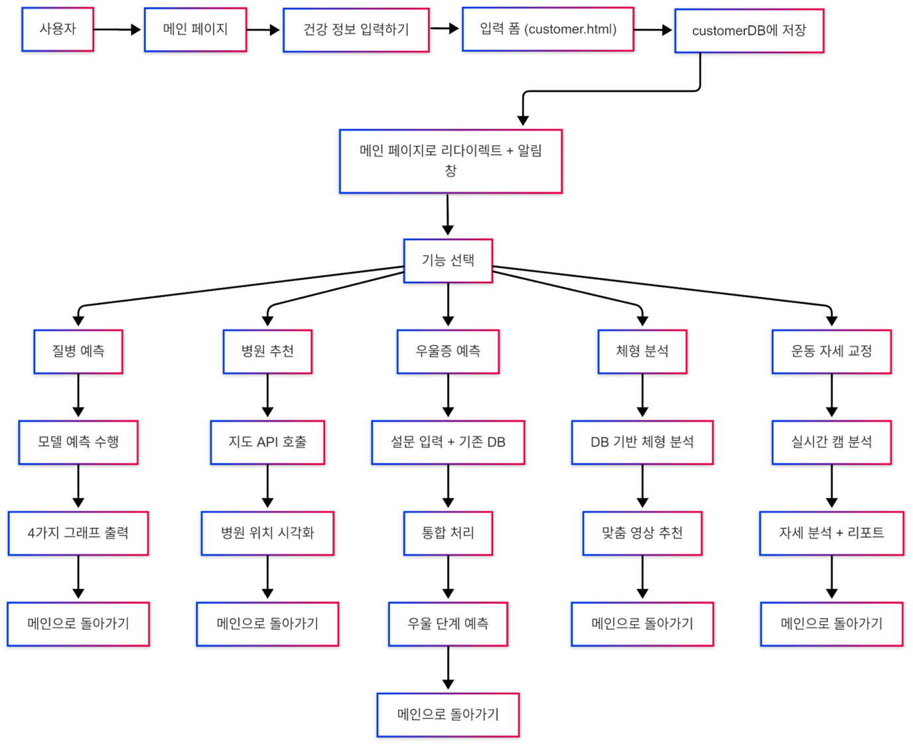

<small>

# ■ FinFit - 개인 맞춤형 헬스케어 서비스 💪

FinFit은 건강 검진 데이터와 AI 예측 모델을 활용하여 사용자의 건강 상태를 정밀 분석하고 맞춤형 솔루션을 제공하는 스마트 헬스케어 서비스를 제공합니다. 또한, 바쁜 현대인을 위해 생활 습관 개선부터 병원 연계까지 체계적인 건강 관리 시스템을 제공하여, 누구나 쉽게 건강을 유지하고 더 나은 미래를 준비할 수 있도록 지원합니다.  

<table>
  <thead>
    <tr>
      <th>항목</th>
      <th>내용</th>
    </tr>
  </thead>
  <tbody>
    <tr>
      <td>개발 기간 🗓️</td>
      <td>
        2025년 2월 24일(월) ~ 2025년 4월 1일(화)
        &nbsp;&nbsp;&nbsp;&nbsp;&nbsp;&nbsp;&nbsp;&nbsp;&nbsp;&nbsp;&nbsp;&nbsp;&nbsp;&nbsp;&nbsp;&nbsp;&nbsp;&nbsp;&nbsp;&nbsp;&nbsp;&nbsp;&nbsp;&nbsp;&nbsp;&nbsp;&nbsp;&nbsp;&nbsp;&nbsp;&nbsp;&nbsp;&nbsp;&nbsp;&nbsp;&nbsp;&nbsp;&nbsp;&nbsp;&nbsp;&nbsp;&nbsp;&nbsp;&nbsp;&nbsp;&nbsp;&nbsp;&nbsp;&nbsp;&nbsp;&nbsp;
      </td>
    </tr>
    <tr>
      <td>프로젝트 목표</td>
      <td>
        - AI 질병 예측과 그래프로 보는 건강 분석 
        - 질병 별 위치기반 병원 매칭 서비스 
        - 체형 분석을 통한 건강 맞춤 운동 솔루션 제공 
        - 검진 데이터 기반 우울증 예측 및 맞춤 정보 제공 
        - AI 분석을 통한 정확한 운동 자세 교정 서비스
        &nbsp;&nbsp;&nbsp;&nbsp;&nbsp;&nbsp;&nbsp;&nbsp;&nbsp;&nbsp;&nbsp;&nbsp;&nbsp;&nbsp;&nbsp;&nbsp;&nbsp;&nbsp;&nbsp;&nbsp;&nbsp;&nbsp;&nbsp;&nbsp;&nbsp;&nbsp;&nbsp;&nbsp;&nbsp;&nbsp;&nbsp;&nbsp;&nbsp;&nbsp;&nbsp;&nbsp;&nbsp;&nbsp;&nbsp;&nbsp;&nbsp;&nbsp;&nbsp;&nbsp;&nbsp;&nbsp;&nbsp;&nbsp;&nbsp;&nbsp;&nbsp;&nbsp;&nbsp;&nbsp;&nbsp;&nbsp;&nbsp;&nbsp;&nbsp;&nbsp;&nbsp;&nbsp;&nbsp;&nbsp;&nbsp;
      </td>
    </tr>
  </tbody>
</table>

## ■ 목차 📚
1. 소개  
2. 프로젝트 진행 관리  
3. 사용 기술 스택  
4. 화면 구성  
5. 데이터 흐름도 및 사용자 흐름도  
6. 아키텍처  
7. How to Test

<h2>■ 소개 🧑‍🤝‍🧑</h2>

<table style="width: 100%; table-layout: fixed; border-spacing: 0; text-align: center;">
  <tr>
    <td style="width: 20%; padding: 10px; vertical-align: middle;">
      

          
        <strong>이한세 (Michael)</strong> 
        <em style="color:#f0a500;"># Squat Analysis</em>
      

    </td>
    <td style="width: 20%; padding: 10px; vertical-align: middle;">
      

          
        <strong>김미경 (Mia)</strong> 
        <em style="color:#f0a500;"># Body & Workout</em>
      

    </td>
    <td style="width: 20%; padding: 10px; vertical-align: middle;">
      

          
        <strong>이준혁 (Simon)</strong> 
        <em style="color:#f0a500;"># Disease Risk</em>
      

    </td>
    <td style="width: 20%; padding: 10px; vertical-align: middle;">
      

          
        <strong>하연우 (Woo)</strong> 
        <em style="color:#f0a500;"># Mental Health </em>
      

    </td>
    <td style="width: 20%; padding: 10px; vertical-align: middle;">
      

          
        <strong>이기성 (Bradley)</strong> 
        <em style="color:#f0a500;"># Hospital Match</em>
      

    </td>
  </tr>
</table>

## ■  주요 기능 및 담당 업무 🤖 

| 주요 기능               | 설명 | 담당자 |
|------------------------|------|--------|
| 운동 자세 교정         | - 사용자의 스쿼트 자세를 **OpenCV와 MediaPipe**로 실시간 추적하고, 무릎 각도를 기반으로 반복 횟수와 정확도를 분석  - 분석된 자세는 **AI 피드백 시스템(Gemini)**을 통해 교정 코멘트와 리포트 이미지로 시각화되며, 자세 개선 여부를 추적 | Michael |
| 체형 예측 및 운동 추천 | - 사용자의 성별, 연령, BMI 등을 기반으로 **랜덤 포레스트 모델로 체형을 예측**하고, 예측된 체형에 맞춰 운동 난이도별 추천 영상을 제공합니다  - 운동 목적(근력/감량 등)에 따른 **효과 기반 필터링 추천**도 제공하며, 영상은 **CSV 데이터 + Plotly 시각화** 기반으로 구성 | Mia |
| 질병 예측              | - 건강검진 데이터를 기반으로 당뇨, 고혈압, 고지혈증 등의 **유병 확률을 RandomForest 모델로 예측**하고, 등급별 위험도를 Plotly 그래프로 시각화  - 추가로 **암 위험도 점수 및 순위 분석**, **2D·3D 건강 상태 차트**를 통해 사용자의 종합 건강 상태를 직관적으로 분석 | Simon |
| 우울증 예측            | - PHQ-9 설문, 수면 시간, 건강 정보를 기반으로 **우울증 단계를 AI 모델이 예측**하고, 결과를 시각 차트로 제공합니다  - **Gemini 챗봇이 개인별 심리 코멘트를 생성**하며, SHAP 분석을 통해 예측에 영향을 준 주요 요인을 시각적으로 설명 | Woo |
| 병원 추천              | - 질병 예측 결과(당뇨, 고혈압, 고지혈증 등)를 기반으로 **사용자 지역 내 '내과' 병원 5곳을 자동 추천**  - 예측된 질병이 있을 경우에만 작동하며, 병원 정보는 **명칭·주소·위치 좌표 포함**으로 제공 | Bradley |

## ■  프로젝트 진행 관리 📊

## ■ Stacks 🛠️

## Language

## Backend(server)

## Frontend

## Data Science / ML

 

## API & External Services

## Dev Tools

## 데이터 흐름도, 사용자 흐름도 🔄
> 사용자 행동경로와 데이터기반 모델흐름, URL구조를 정리한 것입니다.

 

## ■  아키텍처

### ▪ Directory 구조

</small>

